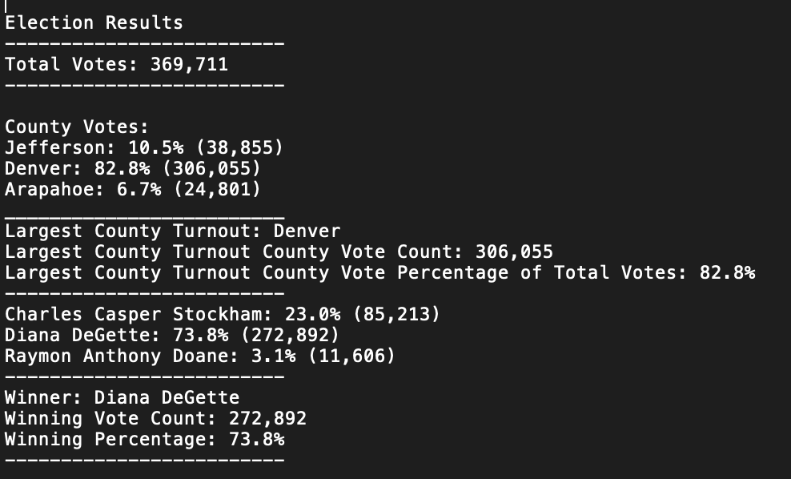
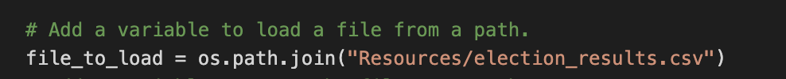

# Election_Analysis

## Project Overview
A Colorado Board of Elections requested the below analysis of a recent local congressional election in order to complete an election audit:

> - Calculate the total number of votes cast.
> - Get a complete list of candidates who received votes.
> - Calculate the total number of votes each candidate received. 
> - Calculate the percentage of votes each candidates won.
> - Determine the winner of the election based on populat vote.

## Resources
> - Data Source: election_results.csv
> - Software: Python 3.7.6, Visual Studio Code 1.47.3

## Summary
The analysis of the election dataset resulted in:
- **There were a total of 369,711 votes cast in the election.**
  - Denver county recorded 306,055 votes, or 82.8% of total votes.
  - Jefferson county recorded 38,855 votes, or 10.5% of total votes.
  - Arapahoe county recorded 24,801 votes, or 6.7% of total votes.
  - *Denver County had the largest number/percentage of total votes.*
  
- **The candidates were:**
  - Charles Casper Stockham
  - Diana DeGette
  - Raymon Anthony Doane
  
Each candidate's results:
  - Charles Casper Stockham received 85, 213 votes, or 23.0% of total votes.
  - Diana DeGette receieved 272,892 votes, or 73.8% of total votes.
  - Raymon Anthony Doane received 11,606 votes, or 3.1% of total votes.
  
**The winner of the election was:**
  - **Diana DeGette who received 73.8% of total votes; 272,892 votes.**
  
  
## Challenge Overview
The purpose of this audit was to determine the county with the highest voter turnout and the winning candidate based on individual county vote count, individual candidiate vote count, and total vote count. Using Visual Studio Code, the provided .csv spreadsheet became the source with each line representing a vote and identifying the county was recorded in and the candidate the vote was recorded for. Using functions to hold and count values for each of the counties/candidiates, the calulations were then used to calculate percentages and print results into a text file for easy sharing with customer.

## Election-Audit Challenge Summary
The included script could be utilized for additional elections when the variables utilized are consistent: .csv file structure with counties being identified in same column and candidate being identified in same column. The script could also be modified for other elections:
- Replace candidates with ballot questions. Ballot questions are typically "Yes" or "No" responses so the analysis would need to convert the string of candidates to boolean. 
- The "county" dictionary could also be modified to reflect different political divisions (city, state) or even specific voting locations. If the database source is different, the analysis would need to point to the new file in order to accomodate the different incoming data and the labels should be changed to reflect the new measure. 
